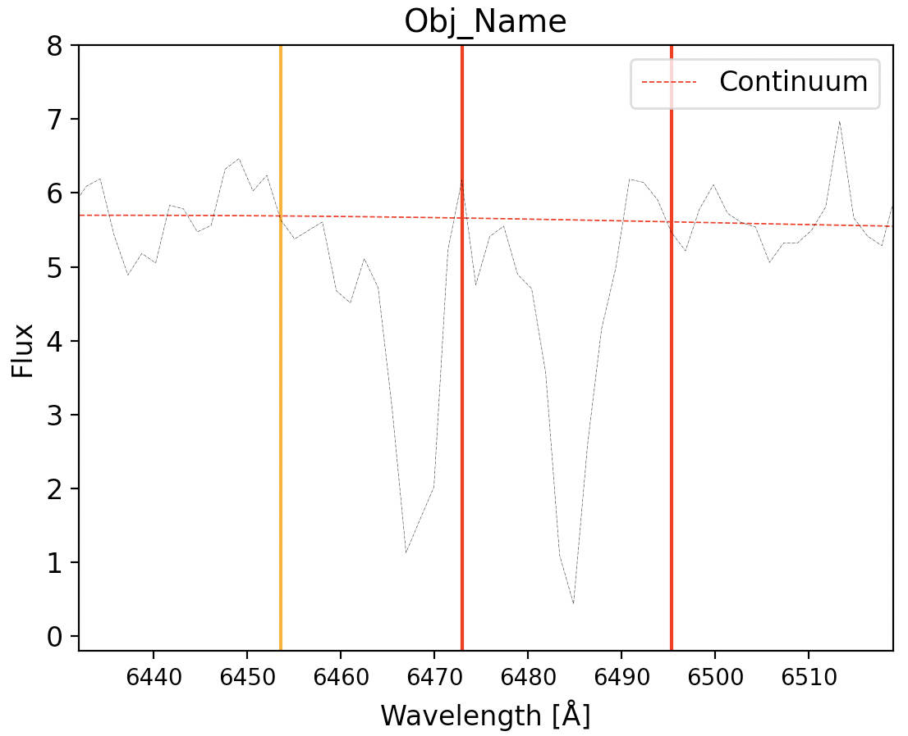
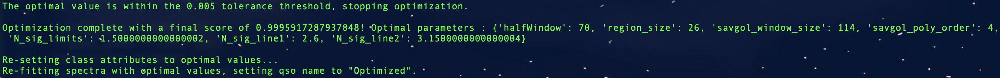
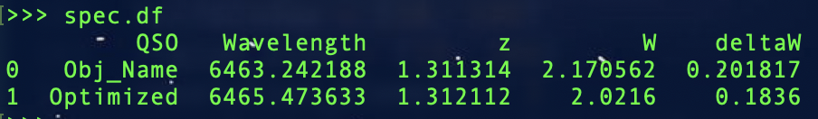

.. _Examples:

Examples
===========
The examples below demonstrate how to use the `spectra_processor <https://linedetect.readthedocs.io/en/latest/autoapi/LineDetect/spectra_processor/index.html#LineDetect.spectra_processor.Spectrum>`_ class to generate the spectra continuum flux and identify specific abosrption features. 

The spectra for one SDSS QSO at a redshift of z=1.8449 can be :download:`downloaded here <spec-0650-52143-0199.fits>`.
This sightline constains a MgII absorber at a redshift of z_mgii = 1.31252 with an equivalent width of 2.016 (see `Cooksey et al 2013 <https://ui.adsabs.harvard.edu/abs/2013ApJ...779..161S/abstract>`_).

.. code-block:: python
    
    import numpy as np
    from astropy.io import fits

    hdu = fits.open('spec-0650-52143-0199.fits')
    z_qso = hdu[2].data['Z'][0] # Redshift
    lam, flux = 10**hdu[1].data['loglam'], hdu[1].data['flux'] #Wavelength and flux arrays
    ivar = hdu[1].data['ivar'] # Flux errors
    flux_err = np.sqrt(np.where(ivar > 0, 1 / ivar, np.inf))

1) Spectrum
-----------
To process the spectral data, initiliaze the ``Spectrum`` class with a ``resolution_range`` of 1500 to 2538.46, corresponding to the minimum and maximum pixel resolution (in km/s), and the rest_wavelengths of the MgII doublet:

.. code-block:: python

    from LineDetect import spectra_processor

    spec = spectra_processor.Spectrum(resolution_range=(1500, 2538.46), rest_wavelength_1=2796.35, rest_wavelength_2=2803.53)

To process a single sample, call the ``process_spectrum`` method -- the arguments include the redshift, ``z``, of the object, the ``Lambda`` array of wavelengths, and the corresponding ``flux`` and ``flux_err`` arrays. Additionally, a ``qso_name`` can be input to differentiate between the saved entries, otherwise the order at which it was saved will be the sole identifier.

.. code-block:: python
    
    spec.process_spectrum(lam, flux, flux_err, z=z_qso, qso_name='Obj_Name')

.. figure:: _static/example_fig1.png
    :align: center
    :class: with-shadow with-border
    :width: 600px
|
A DataFrame is saved as the ``df`` attribute, and if the specified spectral is detected in the spectrum, then the data will be appended to the DataFrame. Note that by default the ``save_all`` class attribute is set to True, which will save entries for which there are no positive detections; these entries will contain the ``qso_name`` followed by 'None' values. If ``save_all`` is set to False, only spectra with positive detection will be appended to the ``df`` attribute.

After running the ``process_spectrum`` method, the instantiated class will contain the ``continuum`` and ``continuum_err`` array attributes. These will be used automatically when calling the ``plot`` method:

.. code-block:: python

    spec.plot(include='both', highlight=True, xlim=(6432,6519), ylim=(-0.2,8), savefig=False)

|

The ``include`` parameter can be set to either 'spectrum' to plot the flux only, 'continuum' to display only the continuum fit, or 'both' for both options.

**IMPORTANT**: If no line is found it is possible that the continuum was insufficiently estimated as a result of low S/N, therefore it is avised to experiment with different program parameters to identify those appropriate for your data. In this example, the redshift of the absorber and hence the equivalent widths are slightly off, to facilitate the tuning procedure the program contains an optimization routine. If the redshift of the absorber is known, you can enter this into the ``optimize`` class method which will optimize the class parameters until this redshift is successfully retrieved:

.. code-block:: python
    
    z_element = 1.31252 # As per Cooksey+13

    # Parameters to tune
    halfWindow = (10, 100)
    region_size = (10, 200)
    resolution_element = 3
    savgol_window_size = (10, 200)
    savgol_poly_order = (1, 7)
    N_sig_limits = (0.1, 5)
    N_sig_line1 = (0.1, 5)
    N_sig_line2 = (0.1, 5)

    n_trials = 250 # Will perform 250 iterations/parameter trials
    threshold = 0.005 # Will stop the optimization if the calculated redshift is within this tolerance

    # Start the optimization
    spec.optimize(lam, flux, flux_err, z_qso=z_qso, z_element=z_element, halfWindow=halfWindow, region_size=region_size, 
        resolution_element=resolution_element, savgol_window_size=savgol_window_size, savgol_poly_order=savgol_poly_order, 
        N_sig_limits=N_sig_limits, N_sig_line1=N_sig_line1, N_sig_line2=N_sig_line2, n_trials=n_trials, threshold=threshold, show_progress_bar=True)

|
In the above example. the parameters designated as tuples will be tuned according to this specified range. Parameters entered as single values (like the resolution element) will not be tuned and the input value will be applied instead. The ``n_trials`` parameter will determine how many optimization iterations to perform, which will be driven according to the input ``z_element`` -- the optimization will stop upon reaching this value or if the ``threshold`` tolerance is met.

With the optimal values we can reproduce the results from Cooksey+13:

|
This spectra also contains a CIV absorber at a redshift of z_civ = 1.52755, with an equivalent witdh of 0.567. Below we demonstrate how to configure the program for this line's detection, note the ``rest_wavelenght_1`` and ``rest_wavelenght_2`` are now set accordingly for this doublet:

.. code-block:: python

    import numpy as np
    from astropy.io import fits
    from LineDetect import spectra_processor

    spec = spectra_processor.Spectrum(resolution_range=(1500, 2538.46), rest_wavelength_1=1548.19, rest_wavelength_2=1550.77)

    hdu = fits.open('spec-0650-52143-0199.fits')
    lam, flux = 10**hdu[1].data['loglam'], hdu[1].data['flux']
    ivar = hdu[1].data['ivar']
    flux_err = np.sqrt(np.where(ivar > 0, 1 / ivar, np.inf))
    z_qso = hdu[2].data['Z'][0]

    z_element = 1.52755

    halfWindow = (10, 100)
    region_size = (10, 200)
    resolution_element = 3
    savgol_window_size = (10, 200)
    savgol_poly_order = (1, 7)
    N_sig_limits = (0.1, 5)
    N_sig_line1 = (0.1, 5)
    N_sig_line2 = (0.1, 5)

    n_trials = 250
    threshold=0.005

    spec.optimize(lam, flux, flux_err, z_qso=z_qso, z_element=z_element, halfWindow=halfWindow, region_size=region_size, resolution_element=resolution_element,
        savgol_window_size=savgol_window_size, savgol_poly_order=savgol_poly_order, N_sig_limits=N_sig_limits, N_sig_line1=N_sig_line1, N_sig_line2=N_sig_line2, 
        n_trials=n_trials, threshold=threshold, show_progress_bar=True)

2) Directory
-----------
As the DataFrame, ``df``, appends new results every time (if ``save_file`` is set to True), files from a directory can be processed at any point, although ccurrently the system supports only the fits format with the following header information:

**[0].header['Z'] is the redshift of the source, [0].data is the 1-D flux, and hdu[1].data the corresponding flux error.**

**[0].header must also contain the redshift information (float) and the appropriate coordinate conversion factor so as to invoke the Astropy World Coordinate System**

To load fits files from a directory, set the ``directory`` attribute and call the ``process_files`` method -- note that the ``qso_name`` that will be saved to the DataFrame will be automatically set to the file name.

.. code-block:: python
	
	spec.directory = '/Path/to/dir/'
	spec.process_files()    

	#Process another directory, the identified lines will be appended to the DataFrame
	spec.directory = '/Path/to/different/dir/'
	spec.process_files()

Unlike when processing single spectra with ``process_spectrum``, this method does not save ``continuum`` and ``continuum_err`` attributes, therefore the ``plot`` method cannot be called to view these samples, they will have to loaded individually for plotting purposes. 

